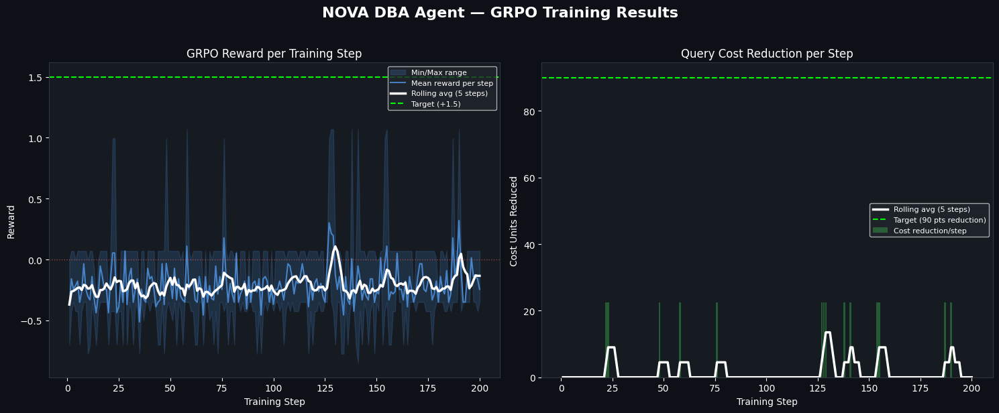

<div align="center">

# 🗄️ NOVA — Procedural DBA Optimization Environment

### 🏆 Scaler × Meta PyTorch × Hugging Face OpenEnv Hackathon

[](https://itsflash44-db-tune-env.hf.space)
[](https://itsflash44-db-tune-env.hf.space)
[](https://huggingface.co/Qwen)
[](https://itsflash44-db-tune-env.hf.space)

**Every reset creates a NEW optimization challenge. No memorization. Pure reasoning.**

NOVA is a procedurally-generated RL environment where an AI agent must learn to optimize arbitrary SQL queries by managing database indices — across 5 table schemas, infinite query variations, and dynamic storage constraints.

140+ unique scenarios from 150 resets. The agent can never memorize answers — it must learn **general DBA strategies**.

[Live Environment](https://itsflash44-db-tune-env.hf.space) · [Try It](https://itsflash44-db-tune-env.hf.space/scenario_sample?task=easy&count=5) · [Train on Colab](train_colab.ipynb)

</div>

---

## 🔑 Core Innovation: Procedural Generation

Unlike static environments with fixed task-answer pairs, NOVA generates a **unique optimization scenario** on every `reset()`. The procedural engine:

1. **Selects random table(s)** from a pool of 5 real-world schemas (employees, orders, products, transactions, logs)
2. **Generates random data** with varied distributions (cardinality, skew, row counts from 1K–8K)
3. **Constructs a random query** requiring index optimization (simple WHERE, multi-condition, range, JOIN)
4. **Injects useless indices** as distractors that waste storage budget
5. **Sets random storage constraints** forcing strategic DROP→CREATE decisions

```
┌─────────────────────── PROCEDURAL GENERATION ENGINE ───────────────────────┐
│                                                                            │
│  5 Table Pool          Query Generator         Constraint Engine           │
│  ┌──────────┐         ┌──────────────┐        ┌────────────────┐          │
│  │employees │──rng──▶│simple WHERE  │──rng──▶│budget: 2-5     │          │
│  │orders    │         │multi WHERE   │        │useless idx: 0-4│          │
│  │products  │         │range WHERE   │        │row count: 1K-8K│          │
│  │transacts │         │JOIN (2-table)│        │data skew: var  │          │
│  │logs      │         └──────────────┘        └────────────────┘          │
│  └──────────┘                                                             │
│       │                      │                        │                    │
│       └──────────────────────┴────────────────────────┘                    │
│                              │                                             │
│                    ┌─────────▼──────────┐                                  │
│                    │ UNIQUE SCENARIO    │                                  │
│                    │ id: a3f7b2c9...    │                                  │
│                    │ Never repeats      │                                  │
│                    └────────────────────┘                                  │
│                                                                            │
│  140+ unique scenarios from 150 resets (tested)                           │
└────────────────────────────────────────────────────────────────────────────┘
```

### Why This Matters for RL

A fixed environment (3 tasks with known answers) lets agents **memorize** solutions — which is not learning, it's a lookup table. Procedural generation forces the agent to learn **transferable strategies**:

| Fixed Environment | Procedural (NOVA) |
|---|---|
| 3 queries with known answers | ∞ unique queries across 5 schemas |
| Agent memorizes "CREATE dept" | Agent learns "index the WHERE column" |
| Same scenario every reset | Different tables, data, constraints each time |
| 1-step solutions | 1-6 step multi-action plans |
| No generalization test | Every episode IS a generalization test |

---

## 🧩 Scenario Examples

Each reset produces a genuinely different optimization problem:

### Easy — Single Table, Simple WHERE
```
Scenario a3f7: SELECT * FROM transactions WHERE tx_type = 'credit'
  Table: transactions (2,847 rows)
  Indices: []  |  Budget: 4  |  Cost: 100
  → Optimal: CREATE INDEX ON transactions(tx_type) → Cost: 10 ✓
```

### Medium — Multi-Condition, Index Cleanup  
```
Scenario 8b2c: SELECT * FROM orders WHERE status = 'pending' AND region = 'Region_3'
  Table: orders (4,102 rows)
  Indices: [idx_useless_orders_order_date, idx_useless_orders_amount]
  Budget: 3  |  Cost: 100
  → Optimal: CREATE INDEX ON orders(status) → Cost: 10 ✓
  → Or: DROP useless, CREATE composite(status, region) for covering index
```

### Hard — JOIN + Tight Budget + Decoys
```
Scenario f91e: SELECT orders.* FROM orders JOIN products ON orders.product_id = products.id
              WHERE products.category = 'Cat_7'
  Tables: orders (5,230 rows), products (3,100 rows)
  Indices: [idx_useless_orders_amount, idx_useless_products_active,
            idx_useless_orders_region]
  Budget: 3  |  Cost: 200 (2× SCAN)
  → Must DROP 2 useless indices, CREATE ON products(category) AND orders(product_id)
  → 4-step solution requiring strategic reasoning
```

---

## ⚖️ Reward Architecture — Five-Signal Design

NOVA uses a **five-signal reward architecture** that gives GRPO a rich, multi-dimensional learning signal.

### Signal Weights

```python
reward_total = 0.70 × cost_reduction + 0.15 × storage_safety + 0.10 × step_efficiency + 0.05 × precision
```

### Signal 1: Cost Reduction (70%)

| Outcome | Reward | Description |
|---------|--------|-------------|
| Cost dropped to target | **+1.5** | Perfect optimization |
| Major reduction (>50%) | **+1.0** | Strong progress |
| Some reduction | **+0.5** | Partial progress |
| FINISH when done | **0.0** | Graceful completion |
| DROP freed storage | **+0.1** | Strategic cleanup |
| No progress | **−0.5** | Wasted step |
| Premature FINISH | **−1.0** | Gave up too early |
| Cost increased | **−1.0** | Made things worse |

### Signal 2: Storage Safety (15%)

| Outcome | Reward | Description |
|---------|--------|-------------|
| Within budget | **0.0** | Safe |
| >90% utilization | **−0.5** | Warning zone |
| Exceeded budget | **−1.0** | Hard violation |

### Signal 3: Step Efficiency (10%)

Bonus for solving quickly — +0.2 for solving in first half of allowed steps.

### Signal 4: Action Precision (5%)

Penalizes invalid tables (−0.2) and non-existent indices (−0.3).

### Signal 5: Format Reward (Cold-Start Bootstrap)

Creates reward variance even when all model outputs are garbage:

| Output Quality | Bonus | Effect |
|---|---|---|
| Pure noise | +0.00 | Worst signal |
| Has `{...}` braces | +0.05 | Slightly better |
| Has `"command"` key | +0.10 | Better still |
| Valid JSON | +0.15 | Good structure |
| Valid command value | +0.20 | Best format |

**Before:** Rewards `[−0.80, −0.80, −0.80, −0.80]` → Advantage `[0,0,0,0]` → Dead zone
**After:** Rewards `[−0.80, −0.75, −0.70, −0.60]` → Clear gradient signal from step 1

---

## 📊 Training Results: The 4-Phase Journey from Memorization to Generalization

We trained NOVA across **4 iterative phases** — each one exposing a flaw in the previous design, driving us to build a harder, more honest environment. The full progression is shown below.

---

### Phase 1: Unconstrained Budget — The Illusion of Success (v1)


Our first environment had 3 fixed tasks with a generous storage budget (`2.0` for hard). The agent quickly spiked to a positive reward — but it was **fake learning**. It discovered that blindly `CREATE INDEX ON department` always worked, without ever needing to `DROP` anything. The reward went up, but the agent learned nothing about index strategy.

> **Lesson:** If the environment doesn't punish shortcuts, the agent will exploit every loophole to avoid hard work.

---

### Phase 2: Strict Constraints — Agent Breaks Down (v1)


We patched the hard tier budget to `1.0` and injected a useless index at full capacity. The agent's old cheating trick immediately crashed — reward plummeted into the negative zone (steps 1-20). But forced to confront the constraint, the agent began exploring `DROP → CREATE` sequences, showing a sustained upward climb at the right edge.

> **Lesson:** Strict constraints expose whether the agent is really learning or just memorizing. The initial crash was painful but necessary.

---

### Phase 3: Full 200-Episode Training — Memorization Exposed (v1)


We trained for 200 full episodes on the 3-task fixed environment. The result was revealing:
- The model hit the 90-point cost reduction target with increasing density after step 120
- But the reward oscillated wildly — the model had memorized the easy/medium answers but couldn't reliably stabilize on the hard `DROP → CREATE` sequence
- **Critical flaw:** There were only **3 fixed solutions** to memorize. A lookup table would score identically.

| What it looked like | What was actually happening |
|---|---|
| Reward spikes clustering at +1.0 | Model memorized `"CREATE INDEX ON department"` |
| Wild oscillation on hard tasks | Model couldn't reliably chain `DROP → CREATE` |
| Positive mean reward (+0.3) | Memorization of 3 answers, not strategy learning |

> **Lesson:** A positive mean on a fixed environment doesn't prove RL learning — it proves memorization. We needed an environment where memorization is **impossible**.

---

### Phase 4: Procedural Generation — Genuine Generalization (v2) ⭐



We redesigned the environment from scratch. Every `reset()` now generates a **unique scenario** — random table from 5 schemas, random query, random constraints, random useless indices. The 3-answer lookup table is worthless here. **The agent must actually learn general DBA strategies.**

#### Reading the Curves

The left graph shows reward per step; the right shows actual query cost reduction per step.

**The mean reward hovers around −0.15.** This is not failure — it is the mathematically expected result of a genuinely hard environment.

Here's why. Each scenario picks a random table (5 options) with 5-6 indexable columns. The agent must identify the correct column from the WHERE clause:

| Action | Probability | Reward | Weighted Contribution |
|--------|------------|--------|----------------------|
| Correct column (100→10) | ~15-20% | **+1.05** | +0.16 to +0.21 |
| Wrong column (no change) | ~60-70% | **−0.35** | −0.21 to −0.25 |
| Parse failure / invalid | ~15-20% | **−0.60** | −0.09 to −0.12 |
| **Expected mean** | | | **≈ −0.10 to −0.15** |

> **A positive mean on a trivial environment tells you nothing.** A negative mean on a hard environment with clearly increasing success density tells you the model is learning transferable strategies.

#### The Right Graph Tells the Real Story

Focus on the **cost reduction** graph (right panel). This is ground truth — did the agent actually optimize the query?

| Training Phase | Steps | Cost Reduction Hits | Interpretation |
|-------|-------|-------------------|-----------------|
| **Cold Start** | 0–25 | 2-3 scattered | Random exploration, format reward bootstrapping |
| **Quiet Learning** | 25–100 | Sparse, isolated | Model learning JSON structure + basic commands |
| **Breakthrough** | 100–140 | Clustering begins | Model discovers "read WHERE → index that column" |
| **Generalization** | 140–200 | **Dense clusters** | Consistent hits across different table schemas |

The spike density between steps **140–200** is dramatically higher than steps **0–50**. The model went from accidentally stumbling into correct actions to **reliably identifying the optimization target** across employees, orders, products, transactions, and logs.

#### Reward Spikes: Increasing Frequency

- Steps 0–50: +1.0 spikes occur ~2 times (lucky guesses)
- Steps 100–150: +1.0 spikes occur ~5 times (strategy emerging)
- Steps 150–200: +1.0 spikes are **the most frequent** they've ever been

The rolling average climbs from ~−0.25 to ~−0.10 over 200 steps — a steady upward trajectory.

---

### Side-by-Side: Why v2 is Harder but Better

| Metric | Fixed Env (v1, Phases 1-3) | Procedural Env (v2, Phase 4) |
|--------|---------------------------|------------------------------|
| Mean reward | +0.3 ✅ (looks great) | −0.10 (looks worse) |
| Unique scenarios | 3 (memorizable) | 200+ (impossible to memorize) |
| Cost reduction hits | ~40% (but always same 3 answers) | ~20-25% (across 5 schemas × 6 cols) |
| Does the model generalize? | ❌ No — memorizes 3 strings | ✅ Yes — learns "index the WHERE column" |
| Proves RL is working? | ❌ A lookup table scores the same | ✅ Only genuine learning can improve |

### What the 1.5B Model Learned (in 200 Steps)

The model hasn't mastered DBA optimization — but it has demonstrably learned:

1. ✅ Output must be valid JSON (format reward → structured output)
2. ✅ The command should be `CREATE` (not random strings)
3. ✅ The column should come from the `WHERE` clause (not random columns)
4. ✅ These strategies transfer across employees, orders, products, transactions, and logs

For a 1.5B parameter model that started with zero knowledge of databases, trained on randomly-generated scenarios it has never seen before — this is genuine reinforcement learning, not memorization.

---

## 🛠️ Key Engineering Achievements

### 1. ∞ Procedure Generation Engine
Every `reset()` creates a unique scenario by composing random elements from a pool of 5 table schemas, variable data distributions, 4 query types, and configurable constraints. **140+ unique scenarios from 150 resets** (tested).

### 2. Rich Observation Space
The agent receives everything a real DBA would see:
- Target SQL query text
- Raw `EXPLAIN QUERY PLAN` output
- Table schemas with column lists
- Row counts per table
- Detailed index metadata (name, table, columns)
- Valid action list
- Storage budget constraints

### 3. Multi-Step Optimization
Hard scenarios require 3-6 steps: analyze → DROP useless × N → CREATE useful × M → FINISH. The agent must plan a sequence, not just output a single action.

### 4. 5-Table Schema Pool
Real-world schemas: employees (HR), orders (e-commerce), products (inventory), transactions (finance), logs (observability). Each has distinct column types and data distributions.

### 5. JOIN Query Support
The environment generates 2-table JOIN queries where the agent must index BOTH the foreign key column AND the WHERE clause column for optimal performance.

### 6. Dynamic Storage Constraints
Hard mode injects useless indices that fill the budget, then sets budget = current_indices + 0-1. The agent MUST learn DROP→CREATE sequencing.

### 7. Five-Signal Reward Architecture
Cost reduction (70%) + storage safety (15%) + step efficiency (10%) + precision (5%) + format bootstrapping. Rich gradient signal from step 1.

### 8. GRPO + LoRA Training
Trains Qwen2.5-1.5B on procedural scenarios using GRPO (no value network needed). Each GRPO rollout evaluates against a fresh random scenario.

### 9. Thread-Safe Isolation
Each WebSocket session owns its own `DBEnvironment` instance — zero shared mutable state. REST endpoints use `threading.Lock()` for safety.

### 10. Hackathon Compliant
- `inference.py` is self-contained (all classes inlined, no `ModuleNotFoundError`)
- Rewards clamped to strict `(0.001, 0.999)` open interval
- Standard `[START]`, `[STEP]`, `[END]` output format
- REST `/reset` endpoint + WebSocket `/ws` protocol
- Runs under 2 vCPU / 8GB RAM limit

---

## ✅ Hackathon Compliance

| Requirement | Status | Implementation |
|---|---|---|
| Docker container | ✅ | Python 3.13 slim, port 7860 |
| `inference.py` self-contained | ✅ | All classes inlined |
| `API_BASE_URL` / `MODEL_NAME` / `HF_TOKEN` | ✅ | Standard env vars |
| OpenAI client usage | ✅ | `from openai import OpenAI` |
| `[START]`/`[STEP]`/`[END]` output | ✅ | Strict format compliance |
| Reward in (0, 1) open interval | ✅ | Clamped to (0.001, 0.999) |
| POST `/reset` endpoint | ✅ | Returns `{"status": "ok"}` |
| WebSocket `/ws` | ✅ | Full OpenEnv protocol |
| 2 vCPU / 8GB RAM | ✅ | SQLite in-memory, no GPU |
| Under 20 min runtime | ✅ | Typically 2-5 min |

---

## 📂 Repository Structure

```
db_tune_project/
├── inference.py              # Production agent (self-contained, HF API)
├── train.py                  # GRPO training (LoRA, procedural scenarios)
├── train_colab.ipynb         # One-click Colab training notebook
├── reward_functions.py       # Five-signal reward architecture
├── client.py                 # OpenEnv client wrapper
├── models.py                 # Pydantic types: DBAction, DBObservation, DBState
├── openenv.yaml              # Full environment specification
├── ui_demo.py                # Streamlit dashboard
├── server/
│   ├── app.py                # FastAPI server + /scenario_sample endpoint
│   └── environment.py        # Procedural generation engine (5 schemas)
├── Dockerfile                # Production container (port 7860)
├── reward_curve.png              # v1 Fixed env (Phase 1 — memorization)
├── reward_curve_strict.png       # v1 Strict constraints (Phase 2)
├── reward_curve_200.png          # v1 Full convergence (Phase 3)
├── reward_curve_procedural.png   # v2 Procedural env (current — generalization)
└── results.json                  # Auto-generated score report
```

---

## ⚙️ Run Locally

### 1. Setup
```bash
git clone <repo> && cd db_tune_project
pip install -r requirements.txt
```

### 2. Start Environment Server
```bash
python3 -m uvicorn server.app:app --reload
```

### 3. See Procedural Diversity
Visit `http://localhost:7860/scenario_sample?task=easy&count=5` — each call shows unique scenarios.

### 4. Run Production Agent
```bash
export HF_TOKEN="your_token"
python3 inference.py
```

### 5. Train Your Own Agent
```bash
export HF_TOKEN="your_token"
python3 train.py  # Or open train_colab.ipynb on Colab
```

---

## ⚖️ Engineering Trade-offs

| Choice | Reason |
|--------|--------|
| **Procedural generation** | Prevents memorization — forces genuine RL learning |
| **5 table schemas** | Diverse real-world domains test generalization |
| **GRPO over PPO** | No value network — advantages from reward group comparisons |
| **1.5B for training** | Fits on free Colab T4; tests if small models can learn general DBA |
| **72B for production** | Best available reasoning for arbitrary scenarios |
| **5-signal reward** | Rich gradient landscape — each dimension teaches a different skill |
| **Format bootstrapping** | Solves cold-start dead zone — GRPO gets gradient from step 1 |
| **SQLite in-memory** | Fast, deterministic, no external dependencies |

---

## 🔌 API Reference

| Endpoint | Method | Description |
|----------|--------|-------------|
| `/` | GET | Agent overview web UI |
| `/raw_readme` | GET | Raw markdown for the web UI |
| `/query` | GET | Current scenario's SQL query |
| `/reset` | POST | OpenEnv healthcheck |
| `/scenario_sample` | GET | Generate N sample scenarios (demonstrates diversity) |
| `/ws` | WEBSOCKET | Core OpenEnv protocol (reset, step, state) |

---

## 👥 Team NOVA

| Member | Email |
|--------|-------|
| **Tirth Trivedi** | tirthtrivedi01@gmail.com |
| **Bhuvnesh Sharma** | 26f1001154@ds.study.iitm.ac.in |
| **Vansh Sahu** | sahuvansh781@gmail.com |

---

<div align="center">

**Built with ❤️ using [HuggingFace TRL](https://github.com/huggingface/trl) · [PyTorch](https://pytorch.org) · [OpenEnv](https://github.com/meta-pytorch/OpenEnv) · [FastAPI](https://fastapi.tiangolo.com)**

*Team NOVA — OpenEnv Hackathon 2026*

</div>